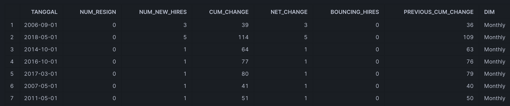
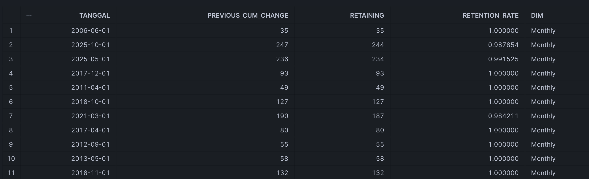
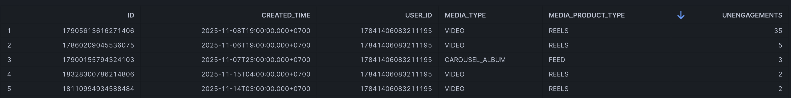

# Technical Test
## Posisi: Data Analytics Engineer
Posisi ini membutuhkan pemahaman software engineering (utamanya konsep modularisasi dan DRY) dan business domain. Dalam tes ini, pemahaman Anda atas pengembangan sistem analitik akan diuji.

## Instruksi Umum
Silakan clone repo ini untuk memperoleh sample data yang akan Anda gunakan untuk membuat data model.

Kemudian, buatlah **dua repo di GitHub** untuk mengembangkan metrik-metrik di bawah ini.

Simpan dan perbarui repo yang Anda gunakan. Pastikan repo Anda dibuka untuk publik agar bisa diakses dan dinilai. Repo yang tidak bisa diakses tidak akan dinilai.

Terakhir, kirim **dua tautan** untuk masing-masing repo melalui sebuah surel sesuai dengan instruksi yang diberikan dalam dokumen khusus.

## Aturan Pengerjaan

### Don'ts
Anda tidak perlu melakukan hal-hal berikut ini:
1. Membuat dasbor
2. Membuat visualisasi
3. Membuat analisis statistik
4. Membuat kontenerisasi dan virtualisasi
5. Mengembangkan script di direktori selain `/models`
6. Membeli layanan apapun untuk membantu penyelesaian tes ini

### Do's
Anda hanya diwajibkan untuk melakukan hal-hal berikut ini:
1. Mengembangkan repositori dengan `dbt-core` 
2. Membuat data model dengan tiga tahapan: **staging -> intermediate -> mart**
3. Demonstrasikan kemampuan Anda dengan SQL yang rapi dan baik, **sesuai dengan kemampuan Anda**
4. Buat **dua repo di bawah ini di GitHub** dengan akses publik

## Repo 1: HR Analytics
Buatlah metrik `headcount_change` dan `retention_rate`.
Gunakan data dan dokumentasi di `/hr_analytics` untuk mengerjakannya.

### Ekspektasi `headcount_change`

Deskripsi: 
Menghitung perubahan jumlah pegawai dari bulan ke bulan.

Sekurang-kurangnya memiliki kolom sebagai berikut.
- `tanggal`: periode bulan ditulis dalam format tanggal di ISO 8601 dan selalu ditulis sebagai awal bulan
- `num_resign`: jumlah pegawai yang resign, ditulis sebagai bilangan negatif
- `num_new_hires`: jumlah pegawai baru, ditulis sebagai bilangan positif
- `cum_change`: jumlah pegawai pada bulan tersebut setelah menghitung `num_resign` dan `num_new_hires`
- `net_change`: hasil kalkulasi `num_resign` dan `num_new_hires`
- `bouncing_hires`: jumlah orang yang resign pada bulan yang sama saat direkrut
- `prev_cum_change`: nilai `cum_change` pada bulan sebelumnya
- `dim`: kategorisasi periode waktu

### Ekspektasi `retention_rate`

Deskripsi: 
Menghitung tingkat retensi pegawai bulanan.

Sekurang-kurangnya memiliki kolom sebagai berikut.
- `tanggal`: periode bulan ditulis dalam format tanggal di ISO 8601 dan selalu ditulis sebagai awal bulan
- `prev_cum_change`: nilai `cum_change` pada bulan sebelumnya (lihat metrik `headcount_change`)
- `retaining`: hasil kalkulasi `num_resign` dan `bouncing_hires` (lihat metrik `headcount_change`)
- `retention_rate`: hasil kalkulasi `prev_cum_change` dan `retaining`
- `dim`: kategorisasi periode waktu

## Repo 2: Instagram Analytics
Buatlah metrik `current_content_unengagement`.
Gunakan data dan dokumentasi di `/instagram_analytics` untuk mengerjakannya.

### Ekspektasi `current_content_unengagement`

Deskripsi: 
Menghitung jumlah tindakan unlike, unsave, uncomment dan unshare per postingan.

Sekurang-kurangnya memiliki kolom sebagai berikut.
- `id`: unique identifier konten yang telah dipublikasi
- `created_time`: waktu publikasi konten dalam WIB
- `user_id`: unique identifier username Instagram
- `media_type`: tipe media yang diunggah di Instagram
- `media_product_type`: kategorisasi `media_type` dalam produk Instagram
- `unengagements`: jumlah unlike, unsave, uncomment dan unshares

 
 
Best of luck!